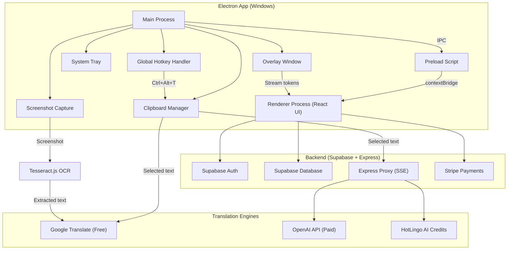
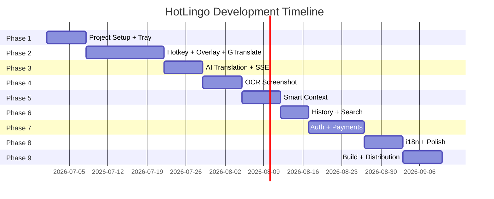

# HotLingo — App Desktop Dịch Tự Động (Windows)

App tray dịch tức thì cho Windows: select text ở bất kỳ app nào → bấm hotkey → bản dịch hiện ngay cạnh cursor. Hỗ trợ OCR screenshot, Smart Context 3 lớp, đa nhà cung cấp (Google Translate free / OpenAI / AI credits).

---

## User Review Required

> [!IMPORTANT]
> **Tech Stack Decision:** Sử dụng **Electron + React + Vite** (`electron-vite`) thay vì .NET/WPF. Điều này cho phép tận dụng kinh nghiệm JS/React hiện có, nhưng bundle size sẽ lớn hơn (~80-150MB thay vì ~10MB native).

> [!IMPORTANT]
> **Backend:** Sử dụng **Supabase** (Auth + Database + Edge Functions) kết hợp **Express.js proxy server** để xử lý SSE streaming từ OpenAI. Cần tạo tài khoản Supabase.

> [!WARNING]
> **Google Translate "miễn phí":** Không có API miễn phí chính thức. Sẽ dùng package `google-translate-api-x` (unofficial scraper). Có rủi ro bị block khi dùng nhiều. Backup plan: **LibreTranslate** (self-hosted) hoặc **Langbly** (500K chars/tháng free).

> [!CAUTION]
> **Global Hotkey trên Windows:** Electron `globalShortcut` hoạt động tốt, nhưng việc capture selected text cần simulate `Ctrl+C` → đọc clipboard. Điều này có thể conflict với clipboard hiện tại của user. Cần backup/restore clipboard.

---

## Open Questions

1. **Hotkey mặc định:** Dùng `Ctrl+Alt+T` (như spec) hay cho phép user custom? Mình đề xuất cho custom nhưng default là `Ctrl+Alt+T`.
2. **Translation Provider mặc định:** Google Translate (free, instant) hay AI translation (chất lượng hơn, cần API key)?
3. **Ngôn ngữ UI:** Bilingual (VN + EN) từ đầu hay VN trước, EN sau?
4. **Tên project:** Giữ tên "HotLingo" hay đặt tên khác?
5. **Auto-update:** Có cần tích hợp auto-update (`electron-updater`) ngay từ đầu không?
6. **OCR Engine:** Dùng `Tesseract.js` (dễ, cross-platform) hay Windows native OCR API (nhanh hơn, nhưng cần native addon)?

---

## Kiến Trúc Tổng Quan



---

## Cấu Trúc Thư Mục Dự Kiến

```
hotlingo/
├── electron.vite.config.ts          # Electron-Vite config
├── package.json
├── tsconfig.json
│
├── src/
│   ├── main/                        # Electron Main Process
│   │   ├── index.ts                 # Entry point, app lifecycle
│   │   ├── tray.ts                  # System tray setup
│   │   ├── hotkey.ts                # Global hotkey registration
│   │   ├── clipboard.ts            # Clipboard backup/restore + read selected
│   │   ├── overlay.ts              # Overlay window management
│   │   ├── screenshot.ts           # Screen capture
│   │   ├── ipc-handlers.ts         # IPC channel handlers
│   │   └── store.ts                # electron-store for settings
│   │
│   ├── preload/                     # Preload Scripts
│   │   └── index.ts                # contextBridge APIs
│   │
│   ├── renderer/                    # React UI (Renderer Process)
│   │   ├── index.html
│   │   ├── main.tsx                # React entry
│   │   ├── App.tsx
│   │   ├── App.css
│   │   │
│   │   ├── components/
│   │   │   ├── TrayPopup/          # Main tray popup window
│   │   │   │   ├── TrayPopup.tsx
│   │   │   │   └── TrayPopup.css
│   │   │   │
│   │   │   ├── Overlay/            # Translation overlay (near cursor)
│   │   │   │   ├── TranslationOverlay.tsx
│   │   │   │   └── TranslationOverlay.css
│   │   │   │
│   │   │   ├── Settings/           # Settings panel
│   │   │   │   ├── SettingsPanel.tsx
│   │   │   │   ├── GeneralSettings.tsx
│   │   │   │   ├── ProviderSettings.tsx
│   │   │   │   ├── ContextSettings.tsx
│   │   │   │   └── Settings.css
│   │   │   │
│   │   │   ├── History/            # Translation history
│   │   │   │   ├── HistoryList.tsx
│   │   │   │   ├── HistoryItem.tsx
│   │   │   │   └── History.css
│   │   │   │
│   │   │   ├── Auth/               # Authentication
│   │   │   │   ├── LoginForm.tsx
│   │   │   │   └── Auth.css
│   │   │   │
│   │   │   └── common/             # Shared components
│   │   │       ├── Button.tsx
│   │   │       ├── Select.tsx
│   │   │       ├── Toggle.tsx
│   │   │       └── Loading.tsx
│   │   │
│   │   ├── hooks/                  # Custom React hooks
│   │   │   ├── useTranslation.ts
│   │   │   ├── useHistory.ts
│   │   │   ├── useSettings.ts
│   │   │   └── useAuth.ts
│   │   │
│   │   ├── services/               # API/Service layer
│   │   │   ├── translationService.ts
│   │   │   ├── googleTranslate.ts
│   │   │   ├── openaiTranslate.ts
│   │   │   ├── ocrService.ts
│   │   │   ├── supabaseClient.ts
│   │   │   └── historyService.ts
│   │   │
│   │   ├── stores/                 # State management (Zustand)
│   │   │   ├── translationStore.ts
│   │   │   ├── settingsStore.ts
│   │   │   └── authStore.ts
│   │   │
│   │   ├── i18n/                   # Internationalization
│   │   │   ├── index.ts
│   │   │   ├── vi.json
│   │   │   └── en.json
│   │   │
│   │   └── styles/                 # Global styles
│   │       ├── variables.css
│   │       ├── reset.css
│   │       └── animations.css
│   │
│   └── shared/                     # Shared types & constants
│       ├── types.ts
│       └── constants.ts
│
├── backend/                         # Express.js Backend
│   ├── package.json
│   ├── server.ts
│   ├── routes/
│   │   ├── translate.ts            # SSE streaming translation
│   │   ├── auth.ts                 # Auth middleware
│   │   └── credits.ts             # Credits management
│   ├── services/
│   │   ├── openai.ts
│   │   └── supabase.ts
│   └── middleware/
│       └── rateLimit.ts
│
├── resources/                       # App resources
│   ├── icon.ico                    # Windows tray icon
│   ├── icon.png                    # PNG fallback
│   └── tray-icons/
│       ├── tray-default.ico
│       └── tray-active.ico
│
└── build/                           # Build configuration
    └── installer.nsh               # NSIS installer script
```

---

## Proposed Changes — Chi Tiết Từng Phase

### Phase 1: Foundation — Electron + React + Tray (Tuần 1)

Thiết lập project cơ bản, system tray, cửa sổ popup.

#### [NEW] Project Setup (`electron-vite` + React + TypeScript)

```bash
npm create electron-vite@latest hotlingo -- --template react-ts
```

**Dependencies chính:**

| Package              | Mục đích                          |
| -------------------- | ------------------------------------ |
| `electron` ^33.x   | Core framework                       |
| `electron-vite`    | Build tool                           |
| `react` ^19.x      | UI framework                         |
| `zustand`          | State management (nhẹ, đơn giản) |
| `electron-store`   | Persistent settings (JSON)           |
| `electron-builder` | Packaging & distribution             |

#### [NEW] [tray.ts](file:///src/main/tray.ts) — System Tray

- Tạo tray icon với context menu (Show/Settings/Quit)
- Click tray icon → toggle popup window
- Icon `.ico` format, hỗ trợ multi-resolution (16x16, 32x32)

#### [NEW] [TrayPopup.tsx](file:///src/renderer/components/TrayPopup/TrayPopup.tsx) — Main UI

- Frameless window, positioned cạnh tray icon
- Tabs: **Translate** | **History** | **Settings**
- Dark theme mặc định, glassmorphism design
- Auto-hide khi click ngoài

---

### Phase 2: Core Translation — Hotkey + Translate + Overlay (Tuần 2-3)

Đây là phần **quan trọng nhất** — trải nghiệm dịch tức thì.

#### [NEW] [hotkey.ts](file:///src/main/hotkey.ts) — Global Hotkey Handler

**Flow khi bấm `Ctrl+Alt+T`:**

```
1. Backup clipboard hiện tại
2. Simulate Ctrl+C (copy selected text)
3. Đợi ~150ms cho clipboard update
4. Đọc text từ clipboard
5. Restore clipboard cũ
6. Lấy vị trí cursor (screen.getCursorScreenPoint)
7. Gửi text đến translation engine
8. Hiển thị overlay window tại vị trí cursor
9. Stream kết quả dịch vào overlay
```

**Libraries cần thiết:**

- `robotjs` hoặc `@nut-tree/nut-js` — Simulate keyboard events
- Electron `globalShortcut` — Register hotkey
- Electron `screen` — Lấy cursor position

#### [NEW] [clipboard.ts](file:///src/main/clipboard.ts) — Clipboard Manager

```typescript
// Backup → Copy → Read → Restore
async function captureSelectedText(): Promise<string> {
  const backup = clipboard.readText();
  clipboard.clear();
  
  // Simulate Ctrl+C
  await keyboard.pressKey(Key.LeftControl, Key.C);
  await keyboard.releaseKey(Key.LeftControl, Key.C);
  
  await sleep(150);
  const selectedText = clipboard.readText();
  
  // Restore original clipboard
  clipboard.writeText(backup);
  
  return selectedText;
}
```

#### [NEW] [overlay.ts](file:///src/main/overlay.ts) — Translation Overlay Window

- `BrowserWindow` với config:
  - `transparent: true` — Nền trong suốt
  - `frame: false` — Không viền
  - `alwaysOnTop: true` — Luôn trên cùng
  - `skipTaskbar: true` — Không hiện taskbar
  - `focusable: false` — Không steal focus từ app đang dùng
- Position: `cursor.x + 10, cursor.y + 10`
- Auto-hide sau 10s hoặc khi click ngoài
- Animate: fade-in khi hiện, fade-out khi ẩn

#### [NEW] [TranslationOverlay.tsx](file:///src/renderer/components/Overlay/TranslationOverlay.tsx)

- UI nhỏ gọn, border-radius, shadow
- Hiệu ứng typing/streaming cho từng token
- Nút copy, nút pin (giữ overlay)
- Hiện source text nhỏ phía trên
- Nút swap language

#### [NEW] [googleTranslate.ts](file:///src/renderer/services/googleTranslate.ts) — Google Translate (Free)

```typescript
import translate from 'google-translate-api-x';

async function translateText(text: string, from: string, to: string) {
  const result = await translate(text, { from, to });
  return result.text;
}
```

- Dùng `google-translate-api-x` (unofficial, free, unlimited)
- Fallback: `google-translate-api-next`
- Không cần API key
- Hỗ trợ 100+ ngôn ngữ
- Auto-detect source language

---

### Phase 3: AI Translation + SSE Streaming (Tuần 3-4)

#### [NEW] [openaiTranslate.ts](file:///src/renderer/services/openaiTranslate.ts) — OpenAI Translation

- Gọi qua Express proxy server (không expose API key)
- SSE streaming: hiện từng token real-time
- Smart Context: inject context vào system prompt
- Model: `gpt-4o-mini` (nhanh, rẻ) hoặc `gpt-4o` (chất lượng)

#### [NEW] Backend Express Server

**Endpoints:**

| Method   | Path                      | Mô tả                      |
| -------- | ------------------------- | ---------------------------- |
| `POST` | `/api/translate/stream` | SSE streaming AI translation |
| `POST` | `/api/translate/simple` | Non-streaming translation    |
| `GET`  | `/api/credits/balance`  | Check credit balance         |
| `POST` | `/api/auth/verify`      | Verify Supabase JWT          |

**SSE Streaming Flow:**

```
Client → POST /api/translate/stream (text, from, to, context)
  ↓
Server → OpenAI chat.completions.create({ stream: true })
  ↓
Server → Pipe chunks: data: {"token": "xin"}\n\n
  ↓
Client → Parse SSE, update overlay UI char-by-char
  ↓
Server → data: [DONE]\n\n
```

---

### Phase 4: OCR Screenshot (Tuần 4-5)

#### [NEW] [screenshot.ts](file:///src/main/screenshot.ts) — Screen Capture

- Hotkey riêng cho OCR: `Ctrl+Alt+S` (đề xuất)
- Flow:
  1. Bấm hotkey → hiện overlay selection tool
  2. User kéo chọn vùng screenshot
  3. Capture vùng đã chọn bằng `desktopCapturer`
  4. Gửi image buffer đến OCR engine
  5. **Không lưu file** — xử lý in-memory
  6. Kết quả OCR → gửi đến translation engine

#### [NEW] [ocrService.ts](file:///src/renderer/services/ocrService.ts) — OCR Engine

```typescript
import Tesseract from 'tesseract.js';

// Worker pool để tránh block UI
const worker = await Tesseract.createWorker('eng+vie');

async function recognizeText(imageBuffer: Buffer): Promise<string> {
  const { data: { text } } = await worker.recognize(imageBuffer);
  return text;
}
```

- **Tesseract.js** — Chạy trong Worker thread, không block UI
- Preload worker khi app start để giảm latency
- Hỗ trợ đa ngôn ngữ (eng, vie, jpn, kor, zho...)
- In-memory processing, không tạo temp file

#### [NEW] Region Selector Overlay

- Fullscreen transparent window
- User kéo chuột để chọn vùng
- Preview vùng đã chọn
- Capture vùng → gửi OCR

---

### Phase 5: Smart Context (Tuần 5-6)

3 lớp context để cải thiện chất lượng dịch:

#### Layer 1: Persistent Context (Cài đặt cố định)

```json
{
  "role": "Bạn là một phiên dịch chuyên nghiệp",
  "domain": "IT/Software Development",
  "tone": "Professional",
  "glossary": {
    "deploy": "triển khai",
    "repository": "kho mã nguồn"
  }
}
```

- Lưu trong `electron-store`
- Áp dụng cho mọi bản dịch AI
- User có thể tùy chỉnh

#### Layer 2: Per-Message Context

```
"Đang dịch email cho khách hàng Nhật, giữ ngữ điệu lịch sự"
```

- Context tạm thời, chỉ áp dụng cho lần dịch tiếp theo
- Input box nhỏ trong overlay
- Auto-clear sau khi dịch xong

#### Layer 3: Per-Screenshot Context

```
"Ảnh UI app mobile, text có thể bị cắt"
```

- Context cho OCR → translation
- Giúp AI hiểu nguồn gốc text (UI, document, chat...)

#### [NEW] [ContextSettings.tsx](file:///src/renderer/components/Settings/ContextSettings.tsx)

- UI quản lý persistent context
- Glossary editor (term → translation)
- Domain selector (IT, Business, Casual, Medical...)

---

### Phase 6: History & Search (Tuần 6)

#### [NEW] [HistoryList.tsx](file:///src/renderer/components/History/HistoryList.tsx)

- Lưu 50 bản dịch gần nhất
- Searchable (tìm theo source text hoặc translated text)
- Mỗi item hiện: source, translation, provider, timestamp
- Click để copy
- Swipe/delete để xóa
- Lưu trong `electron-store` (local, không cần server)

---

### Phase 7: Auth & Payments (Tuần 7-8)

#### [NEW] [supabaseClient.ts](file:///src/renderer/services/supabaseClient.ts) — Supabase Integration

- **Auth:** Email/password + Google OAuth
- **Database tables:**

| Table            | Columns                               | Mô tả                |
| ---------------- | ------------------------------------- | ---------------------- |
| `users`        | id, email, plan, created_at           | User profiles          |
| `credits`      | user_id, balance, updated_at          | AI translation credits |
| `transactions` | id, user_id, amount, type, created_at | Credit transactions    |

#### [NEW] Pricing Model

| Plan           | Giá      | Features                                            |
| -------------- | --------- | --------------------------------------------------- |
| **Free** | $0        | Google Translate unlimited, 5 AI translations/ngày |
| **Pro**  | $9/tháng | AI unlimited, Smart Context, OCR, Premium models    |

#### Stripe Integration

- Checkout session qua Supabase Edge Function
- Webhook xử lý `checkout.session.completed`
- Credit top-up option cho user không muốn subscribe

---

### Phase 8: i18n + Polish (Tuần 8-9)

#### [NEW] Bilingual UI

- `react-i18next` cho i18n
- 2 ngôn ngữ: Vietnamese (default) + English
- Toggle language trong Settings

#### UI/UX Polish

- **Design System:** Dark mode mặc định, accent color gradient
- **Animations:** Framer Motion cho transitions
- **Typography:** Inter font (Google Fonts)
- **Glassmorphism:** Backdrop blur cho overlay và popup
- **Micro-interactions:** Hover effects, loading shimmer, toast notifications

---

### Phase 9: Build & Distribution (Tuần 9-10)

#### Electron Builder Config

```json
{
  "win": {
    "target": ["nsis"],
    "icon": "resources/icon.ico"
  },
  "nsis": {
    "oneClick": true,
    "perMachine": false,
    "allowToChangeInstallationDirectory": false
  }
}
```

- **Installer:** NSIS (Windows installer)
- **Auto-update:** `electron-updater` (optional)
- **Code signing:** Tùy budget (certificate ~$200-400/năm)

---

## Tổng Hợp Dependencies

### Electron App (Frontend)

| Package                    | Version | Mục đích         |
| -------------------------- | ------- | ------------------- |
| `electron`               | ^33.x   | Core                |
| `electron-vite`          | ^3.x    | Build tool          |
| `react`                  | ^19.x   | UI                  |
| `react-dom`              | ^19.x   | React DOM           |
| `zustand`                | ^5.x    | State management    |
| `electron-store`         | ^10.x   | Local storage       |
| `google-translate-api-x` | ^10.x   | Free translation    |
| `tesseract.js`           | ^5.x    | OCR engine          |
| `@nut-tree/nut-js`       | ^4.x    | Keyboard simulation |
| `react-i18next`          | ^15.x   | i18n                |
| `framer-motion`          | ^12.x   | Animations          |
| `electron-builder`       | ^25.x   | Packaging           |

### Backend

| Package                   | Version | Mục đích      |
| ------------------------- | ------- | ---------------- |
| `express`               | ^5.x    | HTTP server      |
| `openai`                | ^4.x    | OpenAI SDK       |
| `@supabase/supabase-js` | ^2.x    | Supabase client  |
| `stripe`                | ^17.x   | Payments         |
| `cors`                  | ^2.x    | CORS             |
| `helmet`                | ^8.x    | Security headers |
| `express-rate-limit`    | ^7.x    | Rate limiting    |

---

## Verification Plan

### Automated Tests

```bash
# Unit tests
npm run test

# E2E tests
npx playwright test
```

- **Unit tests:** Vitest cho translation services, clipboard manager, context logic
- **E2E tests:** Playwright cho UI flows (tray popup, settings, history)

### Manual Verification

1. **Hotkey test:** Select text trong Notepad, VSCode, Chrome → bấm `Ctrl+Alt+T` → verify overlay hiện đúng vị trí
2. **Translation test:** Dịch VN→EN và EN→VN với cả Google Translate và OpenAI
3. **OCR test:** Screenshot text từ ảnh, PDF, UI app
4. **Overlay test:** Verify overlay không steal focus, auto-hide, copy button hoạt động
5. **Tray test:** Click tray icon, context menu, show/hide popup
6. **Streaming test:** Verify SSE streaming hiện token-by-token mượt mà
7. **Multi-monitor test:** Verify overlay hiện đúng trên màn hình đang active
8. **DPI scaling test:** Verify UI đúng trên 100%, 125%, 150% DPI

---

## Timeline Dự Kiến



**Tổng thời gian ước tính: ~9-10 tuần** (làm full-time) hoặc ~3-4 tháng (part-time)

---

## Rủi Ro & Giải Pháp

| Rủi ro                                               | Xác suất  | Giải pháp                                                   |
| ----------------------------------------------------- | ----------- | ------------------------------------------------------------- |
| `google-translate-api-x` bị block                  | Trung bình | Fallback sang LibreTranslate hoặc Langbly                    |
| `robotjs`/`@nut-tree/nut-js` không build được | Thấp       | Dùng`node-key-sender` (Java-based) hoặc PowerShell script |
| Overlay bị focus steal                               | Trung bình | Test kỹ`focusable: false` + `setIgnoreMouseEvents`       |
| OCR chậm với ảnh lớn                              | Trung bình | Giới hạn vùng capture, resize trước khi OCR              |
| Clipboard conflict                                    | Thấp       | Backup/restore nhanh, timeout 200ms                           |
| DPI scaling sai vị trí overlay                      | Trung bình | Test multi-DPI, dùng`screen.getCursorScreenPoint()`        |
